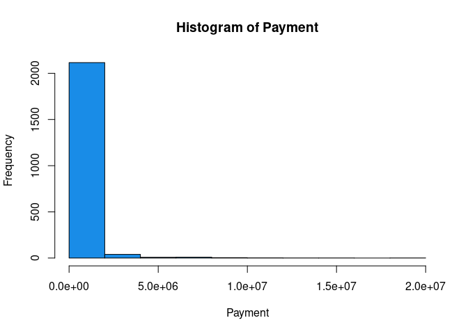

<!-- README.md is generated from README.Rmd. Please edit that file -->

# Insured-Analysis

The code is avaible in the `lol.R` file.

With a series of data which correspond to the claims of an insurer in
Monterrey. It is to analyze and combine the risks of the insurer’s
portfolio. This report is created as a support for the risk committee to
know the influence of the claims with the variables that are known.

The first step is to take a look at our data.

    #>   Kilometres Zone Bonus Make Insured Claims Payment
    #> 1          1    1     1    1  455.13    108  392491
    #> 2          1    1     1    2   69.17     19   46221
    #> 3          1    1     1    3   72.88     13   15694
    #> 4          1    1     1    4 1292.39    124  422201
    #> 5          1    1     1    5  191.01     40  119373
    #> 6          1    1     1    6  477.66     57  170913

You’ll still need to render `README.Rmd` regularly, to keep `README.md`
up-to-date. `devtools::build_readme()` is handy for this. You could also
use GitHub Actions to re-render `README.Rmd` every time you push. An
example workflow can be found here:
<https://github.com/r-lib/actions/tree/master/examples>.

You can also embed plots, for example:

<!-- -->

In that case, don’t forget to commit and push the resulting figure
files, so they display on GitHub.
