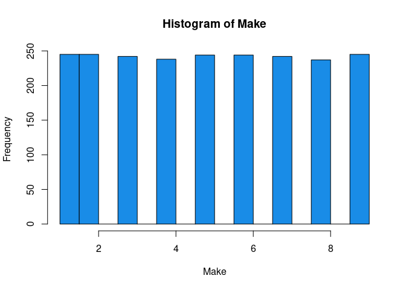
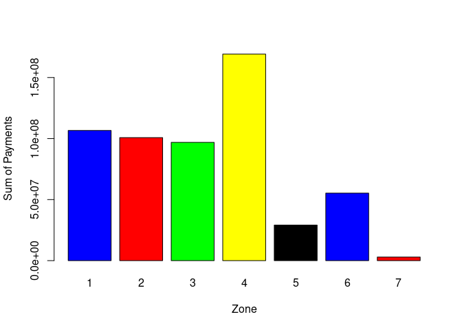
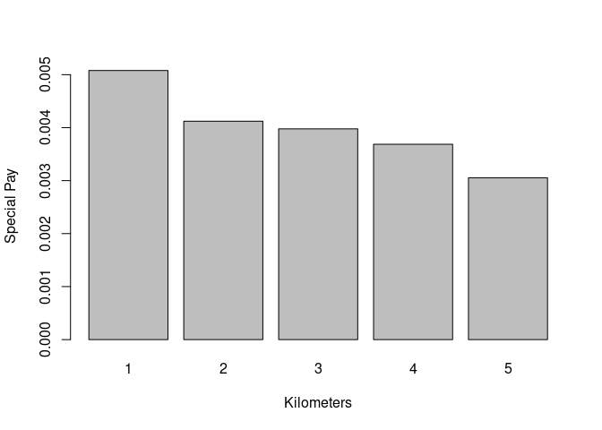
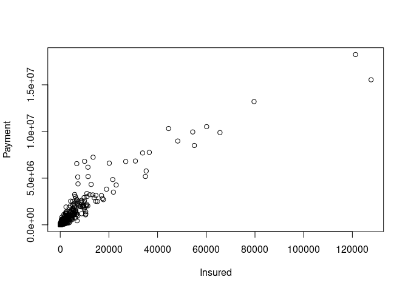

<!-- README.md is generated from README.Rmd. Please edit that file -->

# Insured-Analysis

The code is avaible in the `lol.R` file.

With a series of data which correspond to the claims of an insurer in
Monterrey. It is to analyze and combine the risks of the insurer’s
portfolio. This report is created as a support for the risk committee to
know the influence of the claims with the variables that are known.

The first step is to take a look at our data.

    #>   Kilometres Zone Bonus Make Insured Claims Payment
    #> 1          1    1     1    1  455.13    108  392491
    #> 2          1    1     1    2   69.17     19   46221
    #> 3          1    1     1    3   72.88     13   15694
    #> 4          1    1     1    4 1292.39    124  422201
    #> 5          1    1     1    5  191.01     40  119373
    #> 6          1    1     1    6  477.66     57  170913

-   The kilometers variable describes the category of the number of
    kilometers driven per insured. 1.- &lt;1,000 km. 2.- 1,000 -15,000
    km. 3.- 15,000 - 20,000 km. 4.- 20,000 - 25,000 km. 5.- 25,000 km.

-   The zone variable describes the municipality to which the insured
    belongs. 1.- Monterrey. 2.- San Pedro. 3.- San Nicolas. 4.-
    Escobedo. 5.- Guadalupe. 6.- Garcia. 7.- Others.

-   Variable Bonus: Number of years since the insured filed a claim +1

-   Variable Make: Model of the insured car 1-8 represents a certain
    model and 9 represents the rest.

-   Insured variable: Number of insured per policy year.

-   Claims variable: Number of claims made by the lot or insured.

In order to easily observe our data, a descriptive analysis of the
variables is made through histograms.

<!-- --><!-- --><!-- --><!-- --><!-- --><!-- --><!-- -->

To have a clear idea of the correlation between all the variables in
terms of kilometers, municipality and model. The following graphs were
made.

#### a)Sum of insured per kilometer:

<!-- -->

#### b)Sum of claims per kilometer

<!-- -->

#### c)Sum of pays per kilometer

<!-- -->

We can see in the graphs that a similar trend is followed in the 3 cases
for the relationship between the variables we are using with the
kilometers variable.

#### d)Sum of claims per Zone

<!-- -->

#### e)Sum of Insured per Zone

<!-- -->

#### f)Sum of payments per Zone

<!-- -->

#### g)Sum of claims per Model

<!-- -->

#### h)Sum of Insured per Model

<!-- -->

#### g)Sum of Payments per Model

<!-- -->
