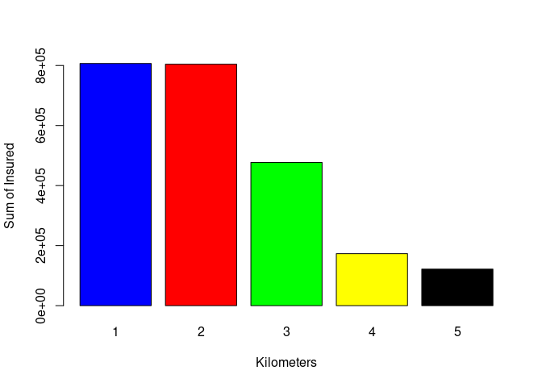

<!-- README.md is generated from README.Rmd. Please edit that file -->

# Insured-Analysis

The code is avaible in the `Insured-Analysis.R` file.

With a series of data which correspond to the claims of an insurer in
Monterrey. It is to analyze and combine the risks of the insurer’s
portfolio. This report is created as a support for the risk committee to
know the influence of the claims with the variables that are known.

The first step is to take a look at our data.

    #>   Kilometres Zone Bonus Make Insured Claims Payment
    #> 1          1    1     1    1  455.13    108  392491
    #> 2          1    1     1    2   69.17     19   46221
    #> 3          1    1     1    3   72.88     13   15694
    #> 4          1    1     1    4 1292.39    124  422201
    #> 5          1    1     1    5  191.01     40  119373
    #> 6          1    1     1    6  477.66     57  170913

-   The kilometers variable describes the category of the number of
    kilometers driven per insured. 1.- &lt;1,000 km. 2.- 1,000 -15,000
    km. 3.- 15,000 - 20,000 km. 4.- 20,000 - 25,000 km. 5.- 25,000 km.

-   The zone variable describes the municipality to which the insured
    belongs. 1.- Monterrey. 2.- San Pedro. 3.- San Nicolas. 4.-
    Escobedo. 5.- Guadalupe. 6.- Garcia. 7.- Others.

-   Variable Bonus: Number of years since the insured filed a claim +1

-   Variable Make: Model of the insured car 1-8 represents a certain
    model and 9 represents the rest.

-   Insured variable: Number of insured per policy year.

-   Claims variable: Number of claims made by the lot or insured.

------------------------------------------------------------------------

### First descriptive analysis

In order to understand in a correct way the data being handled, an
analysis of the dataphrame was made. A sampling of the variables that
are in our model is made, as well as the relationship that they have
with each other.

<!-- --><!-- --><!-- -->

#### a)Sum of insured per kilometer:

<!-- -->

#### b)Sum of payments per Zone:

<!-- -->

#### c)Sum of claims per Model:

<!-- -->

A more exhaustive analysis of each variable as well as the relationship
of one to the other can be found at in the `Insured-Analysis.R` file.

------------------------------------------------------------------------

### Correlation with the variable payments

For the insurance company, it is essential to see the relationship
between the payment variable and the other variables, so we studied the
correlation between the number of claims and the number of years in the
portfolio in order to focus our efforts on strengthening everything that
improves the payments received.

Making a correlation matrix we can see the relationship of one variable
to another.

<!-- -->

It can be seen that the variables with the highest correlation with
payments are Insured and claims. Therefore a scatterplot of these
variables was made.

<!-- --><!-- -->

The committee wants to find the variables that most interfere with
growth or decline. For this purpose, a linear regression was

    #> 
    #> Call:
    #> lm(formula = Payment ~ ., data = data)
    #> 
    #> Residuals:
    #>     Min      1Q  Median      3Q     Max 
    #> -806775  -16943   -6321   11528  847015 
    #> 
    #> Coefficients:
    #>               Estimate Std. Error t value Pr(>|t|)    
    #> (Intercept) -2.173e+04  6.338e+03  -3.429 0.000617 ***
    #> Kilometres   4.769e+03  1.086e+03   4.392 1.18e-05 ***
    #> Zone         2.323e+03  7.735e+02   3.003 0.002703 ** 
    #> Bonus        1.183e+03  7.737e+02   1.529 0.126462    
    #> Make        -7.543e+02  6.107e+02  -1.235 0.216917    
    #> Insured      2.788e+01  6.652e-01  41.913  < 2e-16 ***
    #> Claims       4.316e+03  1.895e+01 227.793  < 2e-16 ***
    #> ---
    #> Signif. codes:  0 '***' 0.001 '**' 0.01 '*' 0.05 '.' 0.1 ' ' 1
    #> 
    #> Residual standard error: 70830 on 2175 degrees of freedom
    #> Multiple R-squared:  0.9952, Adjusted R-squared:  0.9952 
    #> F-statistic: 7.462e+04 on 6 and 2175 DF,  p-value: < 2.2e-16

We observe the variables Claims and Insured as we expected, have very
much relation with Payment according to P-values, at the same,
Kilometres and the Zone have very much relation but less than Claims and
Insured, knowing that, we can plot the linear model together with the
respective variable.

<!-- --><!-- --><!-- --><!-- --><!-- --><!-- -->
